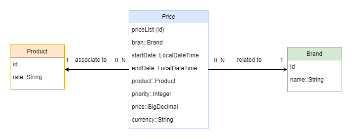

# Test Inditex
Test developed by Carlos Guillén Moreno.

For the correct execution of the application, it will be necessary to have java version 17 and jdk version 20 installed on your computer.

Once you run the application from the main class PruebaApplication, you will be able to make requests to the developed endpoint.

Instances are inserted from the data.sql file, inside the resources' folder. Also, the tables created are in the archive schema.sql.

The following schema represents the relation between the entities:

## How to test the endpoint
To test the endpoint [localhost:8080/prices/find]() you will need a software to execute the requests, like Postman. Inside the folder resources, you will find a json file which contains the request, you only have to import it from Postman program.